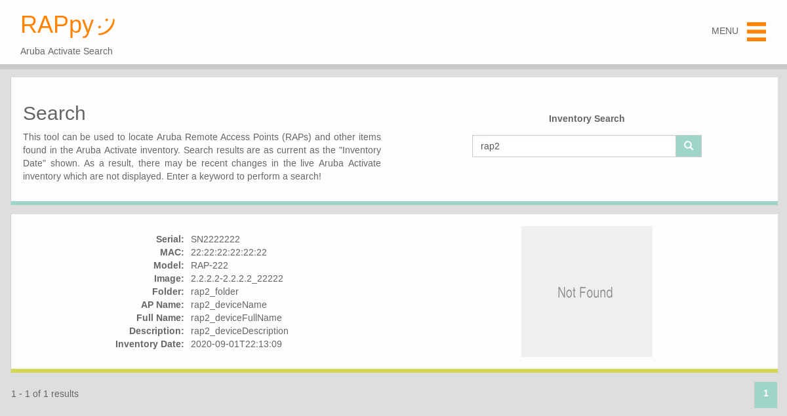

## Screenshot


## Quickstart Installation
```bash
# Create and activate a new Python3 virtual environment
mkdir django_RAPpy
cd django_RAPpy
python3 -m venv venv/
source venv/bin/activate

# Clone the repo in the current dir
git clone https://github.com/bcbrookman/RAPpy.git

# Install django and other dependencies
pip install -r RAPpy/requirements.txt

# Start a new Django project in the current dir
django-admin startproject django_RAPpy .

# Add RAPpy to INSTALLED_APPS in the project settings.py file
echo "INSTALLED_APPS.append('RAPpy')" >> django_RAPpy/settings.py

# Add RAPpy to urlpatterns in the project urls.py file
echo "from django.urls import include" >> django_RAPpy/urls.py
echo "urlpatterns.append(path('', include('RAPpy.urls')))" >> django_RAPpy/urls.py

# Make and apply migrations
python manage.py makemigrations
python manage.py migrate

# Update the database with the initial inventory
python manage.py get_inventory
python manage.py update_db

# Run the development server to test the installation
python manage.py runserver
```